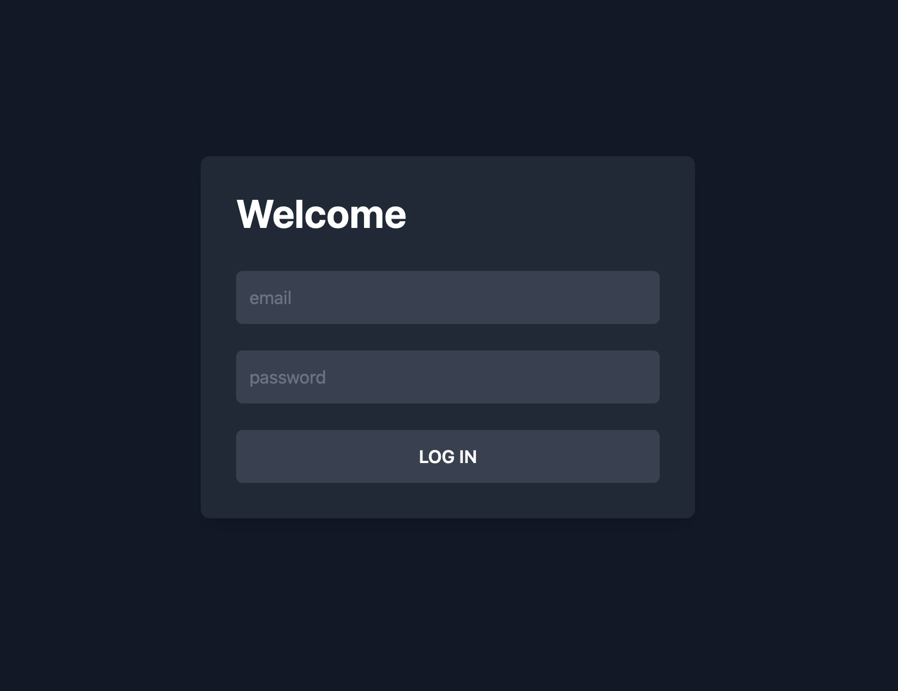
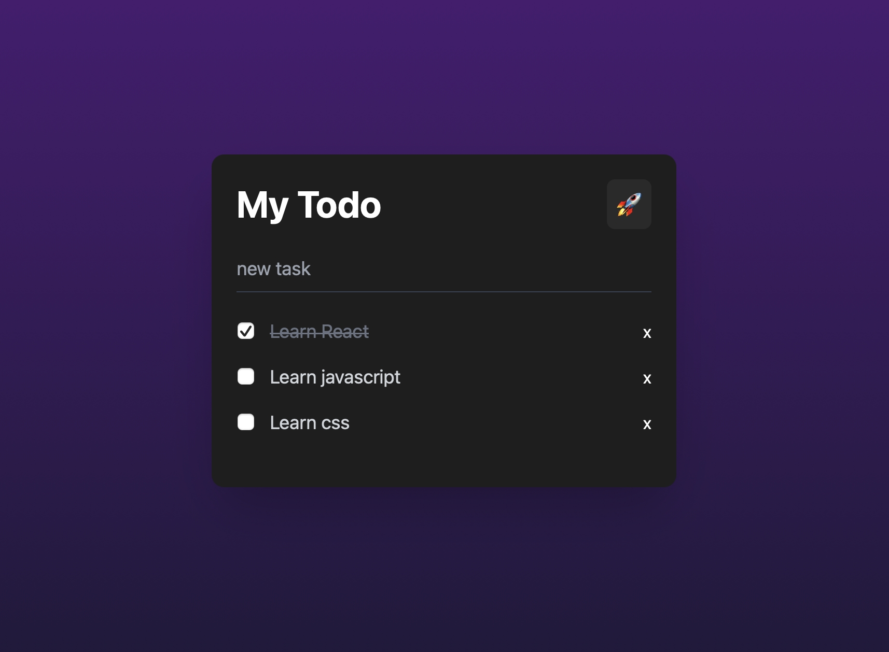

### Part-1 : Setup project (20pts)

- [x] Create Project with Vite (5pts)

- [] Install packages to the project (5pts)

- [] Setup Folder Structures (5pts)

- [] Pick some CSS Framework (5pts)

### Part-2 : Build UI with React Component (35pts)

### 1. Login Page

- [] Inputs (5pts)

- [] Button to Submit (5pts)

### 2. Todo Page

- [] Inputs (2pts)

- [] Button to Edit (2pts)

- [] Button to Submit (2pts)

- [] Button to Delete (2pts)

- [] CheckBox (2pts)

### 3.Naming and Structures

- [] Good Naming for Components (5pts)

- [] Readable Code (easy to read): Good components seperation(10pts)

### Part-3 : Feature and Logic (95pts)

- [] Using React Router (10pts)

- [] Login (Connects to API) (10pts)

- [] Get my Todo (10pts)

- [] Auto Redirect when **Login Success** (10pts)

- [] Create Todo (Connects to API) (10pts)

- [] Can submit form with **"Enter Key"** (10pts)

- [] Update Todo (Connects to API) (10pts)

- [] Delete Todo (Connect to API) (10pts)

- [] Input checkbox could change the data (Connect to API) (10pts)

- [] Good Naming for Functions (5pts)

### Part-3 : Bonus (50pts)

- [] Show validation in Login Page (5pts)

- [] Show validation in Todo Page (5pts)

- [] UI Feature Register (5pts)

- [] Register Feature Connects to API (5pts)

- [] Using State Management (useContext, zustand) (5pts)

- [] Protect Routes (10pts)

- [] Having Loading mechanism (5pts)

- [] Show **Created date** when create todo (5pts)

- [] Setup Well-organized Folder Structures (components, routes, pages, utils, apis) (5pts)

# Can and Can't

- **Can:** Open Slides, Docs, StackOverflow, Google

- **Can:** Ask for discussions (but not direct solutions).
- **Cannot:** Use AI, Copy, or Cheat.
- **Cannot:** Copy-paste code from other projects.